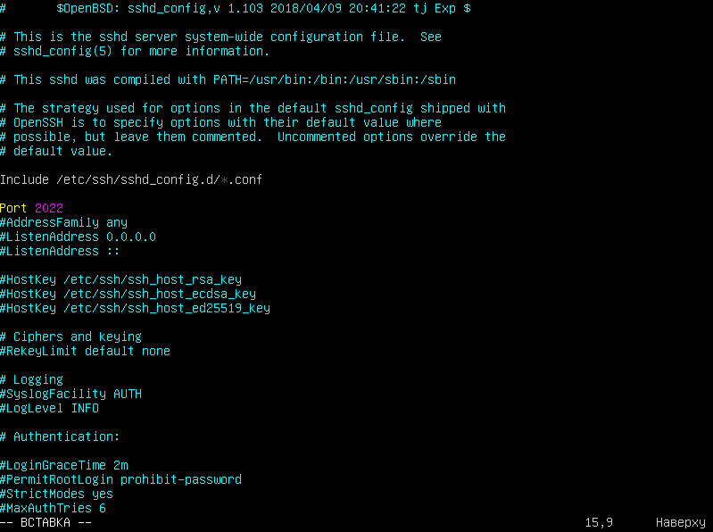

# Операционные системы UNIX/Linux (Базовый).

Установка и обновления системы Linux. Основы администрирования.

## Contents
1 [Установка ОС](#part-1-установка-ос)  
2 [Создание пользователя](#part-2-создание-пользователя)  
3 [Настройка сети ОС](#part-3-настройка-сети-ос)   
4 [Обновление ОС](#part-4-обновление-ос)  
5 [Использование команды  sudo](#part-5-использование-команды-sudo)  
6 [Установка и настройка службы времени](#part-6-установка-и-настройка-службы-времени)  
7 [Установка и использование текстовых редакторов](#part-7-установка-и-использование-текстовых-редакторов)  
8 [Установка и базовая настройка сервиса SSHD](#part-8-установка-и-базовая-настройка-сервиса-sshd)   
9 [Установка и использование утилит top, htop](#part-9-установка-и-использование-утилит-top-htop)   
10 [Использование утилиты fdisk](#part-10-использование-утилиты-fdisk)   
11 [Использование утилиты df](#part-11-использование-утилиты-df)    
12 [Использование утилиты du](#part-12-использование-утилиты-du)    
13 [Установка и использование утилиты ncdu](#part-13-установка-и-использование-утилиты-ncdu)    
14 [Работа с системными журналами](#part-14-работа-с-системными-журналами)     
15 [Использование планировщика заданий CRON](#part-15-использование-планировщика-заданий-cron)    

## Part 1. Установка ОС

1. Скачать [VirtualBox](https://www.virtualbox.org/wiki/Downloads).

2. Используя [инструкцию](https://linuxconfig.org/ubuntu-20-04-server-installation), устанавливаем серверную версию Ubuntu 20.04.

>Версия установленного Ubuntu

## Part 2. Создание пользователя

Создание нового пользователя командой `sudo adduser username` (вместо username мы должны записать имя пользователя, которого мы создадим).

Я создал jolteona2.

- Даю права командой `sudo usermod -aG adm jolteona2`
- Перехожу к пользователю командой `sudo su jolteona2`
- Проверяю записался ли мой новый пользователь в группу командой `groups`

В конце проверка командой `cat /etc/passwd | grep jolteona2`

## Part 3. Настройка сети ОС

Узнаем текущее имя хоста через команду `hostname`.
Командой `sudo hostnamectl set-hostname user-1` меняем имя хоста и сразу проверяем изенения.

Командой `cat /etc/hostname` проверяем поменялись ли данные хоста. Если данные не обновились, тогда при помощи nano 
редактируем файл через команду `sudo nano /etc/hostname`.
командой `sudo nano /etc/hosts` проверяем записи в журнале hosts. Если данные не обновились, тогда при помощи nano 
редактируем файл через команду `sudo nano /etc/hosts`.

**Установить временную зону, соответствующую вашему текущему местоположению.**
Для установки временной зоны используем команду - `sudo timedatectl set-timezone Europe/Moscow`
Проверяем изменения двумя командами `timedatectl` (в терминале) и `cat /etc/timezone` (в журнале)

Вывести названия сетевых интерфейсов с помощью консольной команды - `ip link show`

### 3.1 Расшифровка интерфейса lo

>lo (loopback device) – виртуальный интерфейс, присутствующий по умолчанию в любом Linux. Он используется для отладки сетевых программ и запуска серверных приложений на локальной машине. С этим интерфейсом всегда связан адрес 127.0.0.1. У него есть dns-имя – localhost. Посмотреть привязку можно в файле /etc/hosts.

>lo- loopback локальная петля, нужна для подключения к сети этого же компьютера, доп настроек не требует.

Используя команду `ip address`, мы сможем получить ip address устройства, на котором мы работаем, от DHCP сервера.
Команда `hostname -I` покажет все сетевые адреса host-а (системы), кроме интерфейса loopback.

### 3.2 Расшифровка DHCP

>DHCP (англ. Dynamic Host Configuration Protocol — протокол динамической настройки узла) — прикладной протокол, позволяющий сетевым устройствам автоматически получать IP-адрес и другие параметры, необходимые для работы в сети TCP/IP. Данный протокол работает по модели «клиент-сервер». Для автоматической конфигурации компьютер-клиент на этапе конфигурации сетевого устройства обращается к так называемому серверу DHCP и получает от него нужные параметры. Сетевой администратор может задать диапазон адресов, распределяемых сервером среди компьютеров. Это позволяет избежать ручной настройки компьютеров сети и уменьшает количество ошибок. Протокол DHCP используется в большинстве сетей TCP/IP.
Протокол динамической настройки хоста (DHCP) — это сетевая служба, которая позволяет хост-компьютерам автоматически назначать настройки с сервера, а не вручную настраивать каждый сетевой хост. Компьютеры, настроенные как DHCP-клиенты, не могут контролировать параметры, которые они получают от DHCP-сервера, и конфигурация прозрачна для пользователя компьютера.
Наиболее распространенные настройки, предоставляемые DHCP-сервером DHCP-клиентам, включают:
IP-адрес и сетевая маска,
IP-адрес шлюза по умолчанию для использования,
IP-адреса DNS-серверов для использования.
Однако DHCP-сервер также может предоставлять такие свойства конфигурации, как: имя хоста, доменное имя, сервер времени, сервер печати.
Преимущество использования DHCP заключается в том, что любые изменения в сети, такие как изменение адреса DNS-сервера, необходимо изменить только на DHCP-сервере, и все сетевые узлы будут переконфигурированы при следующем опросе их DHCP-клиентами DHCP-сервера. . В качестве дополнительного преимущества также проще интегрировать новые компьютеры в сеть, так как нет необходимости проверять наличие IP-адреса. Конфликты при распределении IP-адресов также уменьшаются. Клиент настроенный на получение адреса по протоколу DHCP посылает запрос к серверу, и тот в свою очередь предоставляет свободный IP адрес клиенту во временное пользование. DHCP позволяет значительно уменьшить затраченное время на настройку сети, так же позволяет подключать клиента из одной сети в другую без изменения сетевых параметров.
[Подробнее](https://inlnk.ru/DBV2jQ)

**Определить и вывести на экран внешний ip-адрес шлюза (ip) и внутренний IP-адрес шлюза, он же ip-адрес по умолчанию (gw).**
Для получения внешнего адреса необходимо установить специальную утилиту Curl (Client URL).

### 3.3 Curl (Client URL)
> Curl (Client URL) Данная утилита доступна в большинстве систем на основе Unix и часто используется для получения данных по заданному url или передачи и получения файлов по различным протоколам. Команда cURL поддерживает множество протоколов. 
>
>`$ sudo apt-get install curl`
>
>Для работы c URL необходима библиотека libcurl, без нее не будет работать cURL. Если данной библиотеки у вас нет и у вас установлена ОС Ubuntu , то установить ее можно при помощи следующих команд:
>
>`$ sudo apt update` \
>`$ sudo apt install libcurl4`
>[Подробней](https://inlnk.ru/JjgDxp)

После установки Curl для проверки ip адреса используем команду `curl ident.me`

Далее выводим через `ip route` и `ip route  | grep default` информацию на экран

### 3.4 Изменение файла netplan

Переходим к файлу конфигурации командой `sudo nano /etc/netplan/00-installer-config.yaml`, вносим и применяем необходимые изменения:

1) в статусе `dhcp4:` меняем параметр с `true` на `false`
2) создаем параметр `addresses:`, вписываем туда `ip адрес` (который мы получили при выводе команды `ip address` в шаге выше из строки enp0s3 из второй строки inet [10.0.2. 15/24])
3) создаем параметр `gateway4:`, вписываем туда адрес `gw` шлюза (который мы получили при выводе команды `ip route` в шаге выше в строке default via 10.0.2.2) 
4) создаем параметр `nameservers:`, оставляем его пустым, но подним мы заполняем след.параметр 
5) создаем параметр `addresses:`, сюда можем использовать `dns`, например, из задания публичный DNS серверы, например 1.1.1.1 или 8.8.8.8) 
6) сохраняем файл и выходим из него, в командной строке запускаем команду `sudo netplan apply` для обновления конфигурации

**Перезагрузить виртуальную машину. Убедиться, что статичные сетевые настройки (ip, gw, dns) соответствуют заданным в предыдущем пункте.**

Проводим перезагрузку системы с помощью команды `sudo reboot`

Проверяем наши изменения с помощью команды `ip address show` и команды `ip route  | grep default` 
Мы видим на скриншоте, что наши настройки стали статическими

**Успешно пропинговать удаленные хосты 1.1.1.1 и ya.ru и вставить в отчёт скрин с выводом команды. В выводе команды должна быть фраза `"0% packet loss"`**

Для этого нам поможет команда `ping -c 4`, а в качестве испытуемого выступают удаленные хосты `1.1.1.1` и `ya.ru`

## Part 4. Обновление ОС

**Обновить системные пакеты до последней на момент выполнения задания версии.**

Для запуска обновления системы нам поможет команда `sudo apt upgrade`.

Если после обновления системных пакетов ввести команду обновления повторно, появится сообщение об отсутствии обновлений.

## Part 5. Использование команды **sudo**

#### Разрешить пользователю, созданному в [Part 2](#part-2-создание-пользователя), выполнять команду sudo.

**Что такое команда sudo**

>Команда sudo ( substitute user and do, подменить пользователя и выполнить ) позволяет строго определенным пользователям выполнять указанные программы с административными привилегиями без ввода пароля суперпользователя root. Если быть точнее, то команда sudo позволяет выполнять программы от имени любого пользователя, но, если идентификатор или имя этого пользователя не указаны, то предполагается выполнение от имени суперпользователя root. Таким образом, использование sudo позволяет выполнять привилегированные команды обычным пользователям без необходимости ввода пароля суперпользователя root . Список пользователей и перечень их прав по отношению к ресурсам системы может быть настроен оптимальным образом для обеспечения комфортной и безопасной работы. Например, команда sudo в Ubuntu Linux, используется в режиме, позволяющем выполнять любые задачи администрирования системы без интерактивного входа под учетной записью root.

- Используя команду `sudo usermod -aG sudo jolteona2`, добавил пользователя jolteona2 в группу супер пользователей.
- Используя команду `sudo -l -U jolteona2`, проверил добавление в группу.

- Используя команду `su jolteona2` сменил пользователя на jolteona2.
- Используя команду `groups` проверил группы пользователя.
- Используя команду `hostname` узнал hostname.
- Используя команду `sudo hostnamectl set-hostname 'user-jolteona2'`, установил новый hostname.

Проверка изменения имени хоста командой  `hostname`

## Part 6. Установка и настройка службы времени

**Настроить службу автоматической синхронизации времени.**

### 6.1 Утилита NTP

> NTP (Network Time Protocol) — это сетевой протокол для синхронизации системного времени компьютера через сетевое соединение. NTP-клиент запрашивает время у общедоступного NTP-сервера, а затем использует ответ сервера для корректировки локальных часов. Когда NTP-клиент синхронизирует свои часы, используется UDP-порт 123.
>
> [Подробней](https://inlnk.ru/xvYzMa)

Для настройки времени нам потребуется утилита NTP:
- Устанавливаем командой  `sudo apt install -y ntp` 
- Проверяем настройки командой `dpkg -l | grep "ntp"` 
- Обновляем до последней версии командой `sudo apt update`

Используя команду `ntpq -p` проверим, что NTP подключён к серверам времен

Командой `sudo systemctl start ntp` запускаем работать модуль, после чего можем проверить 
статус его работы командой `sudo systemctl status ntp`

Командой `sudo ntpd -gq` принудительно синхронизируем.

Командой `timedatectl` проверяем в конце всю нашу работаспособность еще раз

## Part 7. Установка и использование текстовых редакторов 

Установим три текстовых редактора:

Устанавливаем Joe с помощью команды `sudo apt install joe`:

Устанавливаем Vim с помощью команды `sudo apt install vim`:

Устанавливаем Nano с помощью команды `sudo apt install nano`:

>Для редактирования файлов необходимо открывать их через sudo!!!

### Редактор JOE

Для создание файла в Joe
используем команду `sudo joe test_JOE.txt`

- Записал имя пользователя jolteona в файле test_JOE.txt. 
- Команда `Сontrol+k` позволит выбрать нужную функцию для управления файлом
- Нажимая после этого `Q` мы можем выйти из редактора. Прежде, чем выйти, редактор спросит – сохранить изменения или нет 
- Нажимая кнопку `Y` мы соглашаемся с сохранением внесеных изменений, при нажатии на кнопку `N` сохранения не произойдет. После будет произведен выход из файла

Для редактирования файла необходимо открыть его с помощью команды `sudo joe test_JOE.txt` и заменить текст.
Чтобы выйти без сохранения необходимо нажать группу кнопок: `Сontrol+k, Q, N`.

Для поиска нажимать `Сontrol+k` и потом `F` пишем искомое слово и дважды нажать enter

Для замены слова нажать `Сontrol+k`, затем `F` пишем искомое слово, затем `R` затем пишем новое слово и после этого нажать enter.

Провел замену слова в Joe с `School` на `Jolteona`

Результат замены

### Редактор Vim

Для создание файла в Vim
используем команду `sudo vim test_VIM.txt`

- Записал имя пользователя jolteona в файле test_VIM.txt. 
- C помощью команды `:wq` выйдем с сохранением изменений.

Для редактирования файла необходимо открыть его с помощью команды `sudo vim test_VIM.txt` и заменить текст.
Чтобы выйти без сохранения необходимо выполнить команду `:q!`.

Для поиска слов необходимо выполнить команду `/искомое слово`

Для замены слова необходимо выполнить команду `:s/искомое слово/слово замены/[flags]`.

Провел замену слова в Vim с `School` на `Jolteona`.

Результат замены

### Редактор Nano

Для создание файла в Nano
используем команду `sudo vim test_NANO.txt`

- Записал имя пользователя jolteona в файле test_NANO.txt. 
- C помощью команды `Control+X, Y` выйдем с сохранением изменений.

Для редактирования файла необходимо открыть его с помощью команды `sudo nano test_NANO.txt` и заменить текст.
Чтобы выйти без сохранения необходимо выполнить команды `Control+X, N`.

Для поиска слов необходимо выполнить команду `Control+W` затем ввести искомое слово и нажать enter.

Провел замену слова в Nano с `School` на `Jolteona`.
Для замены слова необходимо выполнить команду `Control+\`, затем ввести искомое слово и нажать enter.

После необходимо ввсети заменяемое слово и нажать enter.

После Ввести `Y` и получить результат

## Part 8. Установка и базовая настройка сервиса **SSHD**

Установка ssh командой `sudo apt install openssh-server`.
Для того, чтобы служба запускалась автоматически нужно добавить её в автозагрузку `sudo systemctl enable sshd`.
Для проверки перезагружаем систему командой `sudo reboot`, после чего используем команду `ps ua | grep sshd`.

> ps (показывает запущенные процессы, выполняемые пользователем в окне терминала). Используем утилиту grep для того, чтобы отобрать нужные нам процессы по определенному критерию. -e или -A (Чтобы просмотреть все запущенные процессы); -u, (U) - выбрать процессы пользователя.
-d (Чтобы показать все процессы, кроме лидеров сессии); -d -N (можно инвертировать вывод с помощью переключателя -N. Например, если хочу вывести только лидеров сеансов); T (увидеть только процессы, связанные с этим терминалом); r (просмотреть все работающие (running) процессы); -p 'pid' (если вы знаете идентификатор процесса PID, вы можете просто использовать следующую команду, для вывода процесса с этим 'pid'); -p 'pid1' 'pid2' ps U 'userlist' (найти все процессы, выполняемые конкретным пользователем); -ef (получить полный список); -t (--tcp) отображает соедниеня только по tcp; -a (--all) вывод всех активных подключений TCP; -n (--numeric) вывод активных подключений TCP с отображением адресов и номеров портов в числовом формате; -С - выбирать процессы по имени команды; -G - выбрать процессы по ID группы; -s - выбрать процессы по ID сессии;
>

В настройках VirtualBox нужно добавить сеть с именем SSHD с портом хоста 2022 и с портом гостя 2022.
Адрес хоста (т.е. машины где установлена система VirtualBox - это 127.0.0.1).
Адрес гостя - адрес внутри виртуальной машины (10.0.2.15).

Сменил порт, на котором работает ssh на 2022. Через команду `sudo vim /etc/ssh/sshd_config` 

- Сохранил, перезапустил командой `sudo systemctl restart ssh` и проверил командой `sudo service sshd status`

- Проверяю статус фаервола командой `sudo ufw status` (статус - inactive), командой `sudo ufw enable` мы ставим активный статус 

- В брандмауэре нужно разрешить доступ к новому порту ssh, для этого выполним команду `sudo ufw allow 2022`
- Также необходимо загрузить `sudo apt install net-tools`.

### NETSTAT

> NETSTAT - отображение статистики сетевых соединений.
-t - Отображение текущего подключения в состоянии переноса нагрузки с процессора на сетевой адаптер при передаче данных
-a - Отображение всех подключений и ожидающих портов
-n - Отображение адресов и номеров портов в числовом формате.
Proto: Название протокола (протокол TCP или протокол UDP);
Recv-Q: очередь получения сети;
Send-Q: означает, что данные помещены в буфер отправки TCP/IP, но не отправлены или отправлены, но не подтверждены. Таким образом, высокое значение в Send-Q может быть связано с перегрузкой сети сервера, проблемой производительности сервера или управлением потоком пакетов данных и так далее.
Local Address: локальный IP-адрес участвующий в соединении или связанный со службой, ожидающей входящие соединения (слушающей порт). Адрес 127.0.0.1 - это петлевой интерфейс, используемый в качестве средства IP протокола для взаимодействия между процессами без реальной передачи данных.
Foreign Address: Внешний IP-адрес, участвующий в создании соединения.
State: Состояние - состояние соединения. Состояние Listening говорит о том, что строка состояния отображает информацию о сетевой службе, ожидающей входящие соединения по соответствующему протоколу на адрес и порт, отображаемые в колонке.

- Теперь когда получилось сделать соединение, мы можем присоединиться к серверу Ubuntu от Windows, для этого выставляем настройки как на картинке и жмем `Open`.

- После этого подключаемся к серверу, логинимся и работаем удалённо с Windows на Ubuntu

вызываем команду `netstat -tan`

>Если в качестве адреса отображается 0.0.0.0 , то это означает - "любой адрес", т.е в соединении могут использоваться все IP-адреса существующие на данном компьютере.
>

>-tan это комбинация трех флагов: -t(--tcp) -a(--all) -n(--numeric)
>

## Part 9. Установка и использование утилит **top**, **htop**

Проводим установку утилиты htop командой `sudo apt install htop`
Проводим установку утилиты top командой `sudo apt install top`

**Вывод команды топ:**

Отчет:

- uptime: 12min
- кол-во авторизованных пользователей: 1
- общую загрузку системы: 0,17, 0,22, 0,25
- общее количество процессов: 99
- загрузку cpu: 0,3
- загрузку памяти: 219,1 / 428,0

Нажимаем 'F', выбираем %MEM, нажимаем 's' и 'q' после чего видим процесс, занмающий большую память

- pid процесса занимающего больше всего памяти: 1354

Нажимаем 'F', выбираем %CPU, нажимаем 's' и 'q' после чего видим процесс, занмающий большую память

- pid процесса, занимающего больше всего процессорного времени: 663

**Вывод команды htop:**
**отсортированному по PID, PERCENT_CPU, PERCENT_MEM, TIME**

Запускаем команду `htop` в терминале

`F6` - открывает панель с выбором параметра сортировки процессов

Выбираем фильтр `PID`:

Выбираем фильтр `CPU` (PERCENT_CPU)

Выбираем фильтр `TIME+` (TIME)

Выбираем фильтр `MEM%` (PERCENT_MEM)

отфильтровать процессы и найти процессы `sshd`
F4 — сортировка списка процессов

найти процесс `syslog`, используя поиск
F3 — поиск процесса

с добавленным выводом `hostname`, `clock` и `uptime`
F2 — настройки

Отображение отчета с учетом внесеных изменений в шапку работающей системы с выводом `hostname`, `clock` и `uptime`

## Part 10. Использование утилиты **fdisk**

Запустить команду `sudo fdisk -l`

**В отчёте написать:**
- название жесткого диска: VBOX HARDDISK
- его размер: 100 GiB
- количество секторов: 209715200
- размер swap: 2G

## Part 11. Использование утилиты **df** 

Запустить команду `df`

>df (аббревиатура от disk free) — показывает список всех файловых систем по именам устройств, сообщает их размер, занятое и свободное пространство и точки монтирования.

**В отчёте написать для корневого раздела (/):**
- размер раздела: 1992552
- размер занятого пространства: 213492
- размер свободного пространства: 1657820
- процент использования: 12%

**Определить и написать в отчёт единицу измерения в выводе: 1K.**

Запустить команду `df -Th`

>-h - выводить размеры в читаемом виде, в мегабайтах или гигабайтах, 
>-T - тип файловой системы.

**В отчёте написать для корневого раздела (/):**
- размер раздела: 2.0G
- размер занятого пространства: 209M
- размер свободного пространства: 1.6G
- процент использования: 12%

**Определить и написать в отчёт тип файловой системы для раздела: ext4.**

## Part 12. Использование утилиты **du**

Запустить команду `du` Просто команда `du` показывает кол-во открытых каналов, однако с добавлением флага `du -h` мы увидим уже размер в kb

>du (аббревиатура от англ. disk usage) — стандартная Unix-программа для оценки занимаемого файлового пространства. По умолчанию показывает размер файлового пространства, занимаемого каждым файлом и каталогом в текущем каталоге.

**Вывести размер папок /home, /var, /var/log (в байтах, в человекочитаемом виде)**

Используем команду `sudo du -sh /var/log /home /var`
Мы можем через пробел перечислить все папки 

>-s - вывести только общий размер всех файлов и папок

**Вывести размер всего содержимого в /var/log (не общее, а каждого вложенного элемента, используя * )**

Используем команду `sudo du -sh /var/log/*`

## Part 13. Установка и использование утилиты **ncdu**

Установить утилиту `ncdu`
Для установки утилиты нам потребуется команда `sudo apt install ncdu`

**Вывести размер папок /home, /var, /var/log**

Выводим размер папки /home с помощью команды `sudo ncdu /home`

Выводим размер папки /var с помощью команды `sudo ncdu /var`

Выводим размер папки /var с помощью команды `sudo ncdu /var/log`

- Размеры должны примерно совпадать с полученными в Part 12. - **Совпадение есть**

## Part 14. Работа с системными журналами

**Открыть для просмотра:**
/var/log/dmesg

Для открытия содержимого журнало воспользуемся командой `cat` с указанием адреса расположения файла относительно корневой папки следующим образом `cat /var/log/dmesg`

>dmesg — в этом логе хранится информация о загрузке ядра и драйверов оборудования. В момент загрузки системы записывается вся основная информация, имеющая к ней отношение. Если у вас будут какие-то ошибки во время старта сервера, вы сможете их увидеть в этом логе.
>

**Открыть для просмотра:**
/var/log/syslog

Для открытия содержимого журнало воспользуемся командой `cat` с указанием адреса расположения файла относительно корневой папки следующим образом `cat /var/log/syslog`

>syslog - глобальные системные журналы операционной системы linux. Сюда пишутся события загрузки, ядра системы, системы инициализации systemd и т.д.
>

**Открыть для просмотра:**
/var/log/auth.log

Для открытия содержимого журнало воспользуемся командой `cat` с указанием адреса расположения файла относительно корневой папки следующим образом `cat /var/log/auth.log`

>auth.log — лог авторизации и аутентификации в системе, в том числе ssh.

**Написать в отчёте:**

Время последней успешной авторизации: May 15 17:53:20
Имя пользователя: jolteona
Метод входа в систему: Вход по поролю

**Перезапустить службу SSHd.**

Для перезапуска SSHd службы нам нужно воспользоваться командой `sudo service sshd restart` 
А для вывода информации на экран об restart мы можем вывести командой `tail /var/log/auth.log`

## Part 15. Использование планировщика заданий **CRON**

**Используя планировщик заданий, запустите команду uptime через каждые 2 минуты**

Для входа в журнал для записи воспользуемся командой `crontab -e` При первом использование у нас утилита спросил через какой редактор открыть журнал и предоставит на выбор все возможные редакторы

В данном журнале нам необходимо вписать следующую строку `*/2 * * * * uptime  | wall`
сохраняем все изменения и выходим 

>Cron (Command Run ON) — система для автоматического запуска программ и скриптов на сервере в определённое время.
Управлять cron нужно с помощью команды 'crontab'.
Команда crontab -l покажет список текущих заданий, crontab -e автоматически запустит текстовый редактор и загрузит в него файл конфигурации cron. После выхода из редактора, новая конфигурация cron будет установлена (вступит в силу) автоматически.
>
>Конфигурационный файл содержит последовательность командных строк и расписание их вызова. Пустые строки и строки, начинающиеся с символа '#' игнорируются. Остальные строки являются установками переменных окружения и командами cron.
>
>Запись crontab- файла в общем случае состоит из семи полей:
минуты   часы   день  месяц   день_недели  имя_пользователя   команда
>
>[Помощник](https://crontab.guru/every-2-minutes) по crontab

После того как мы внесли изменения в журнал в терминале каждые 2 минуты появляется следующие сообщение:

Так же мы можем проверить и в системном журнале какие действия у нас происходят и туда записываются, с помощью команды `cat /var/log/syslog`

Удаляем задание из планировщика заданий.

